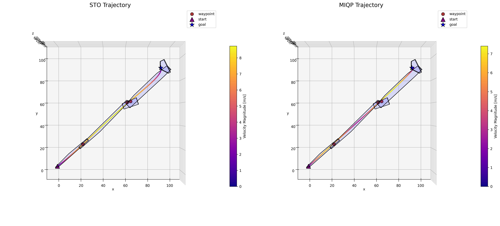
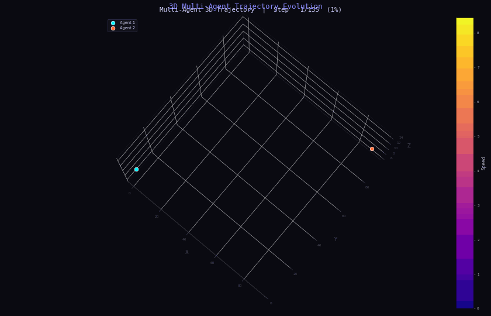
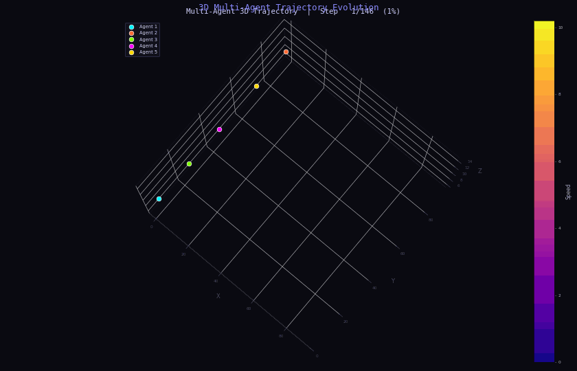
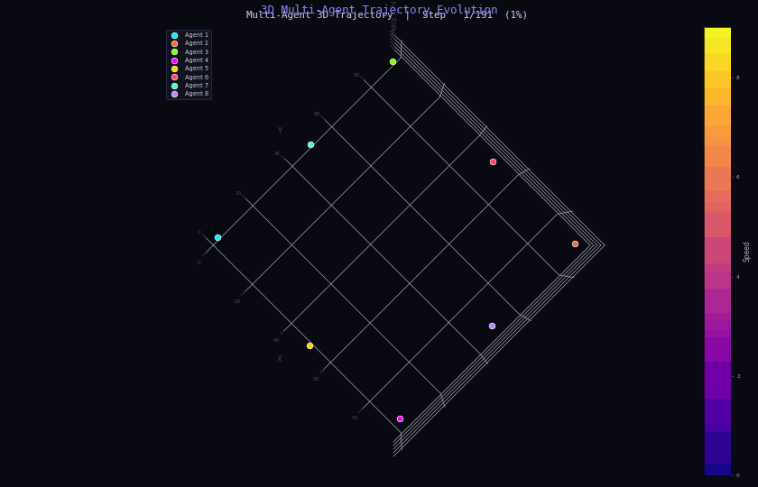
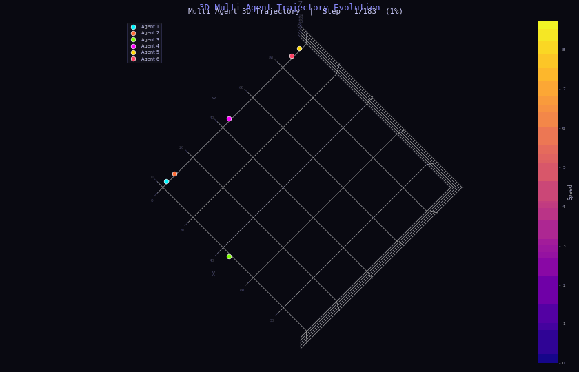

# Multi-Agent-Trajectory-Planning

> **Note:** This repository is shared for viewing purposes only. Source code is not publicly available.

This project investigates trajectory planning for autonomous aerial vehicles (drones) operating within **safe flight corridors (SFC)** — predefined regions of space that guarantee obstacle-free movement. Two established optimization methods are implemented and compared:

- **Mixed-Integer Quadratic Programming (MIQP)** [1] — a classical mathematical approach that selects optimal trajectory segments by solving a discrete-continuous optimization problem.
- **Spatio-Temporal Optimization (STO)** [2] — a geometry-aware method that jointly optimizes the shape and timing of a trajectory for smooth, efficient flight.

Beyond the single-agent comparison, this work introduces an extension of STO to coordinate **multiple drones simultaneously**, achieving collision-free flight through iterative global optimization.

---

## Single Agent Performance

The figure below shows a trajectory planned within a safe flight corridor, with color encoding the drone's velocity along the path.

---

## Multi-Agent Collision Avoidance (Centralized Framework)

To prevent collisions between multiple drones, this work introduces two complementary constraint types:

- **Spatio-Temporal Constraint (STC):**  Enforces gate constraints within a certain duration based on the original trajectory.
- **Spatial Section Constraint (SSC):** Enforces geometry-based separation based on collision types.

| SSC | STC |
|-----|-----|
|  |  |

### Combined Simulation

The following examples demonstrate both constraints applied together across multiple drones navigating crossing trajectories — both in structured and randomized scenarios.

  
  

---

## Acknowledgement

This project was completed as a semester thesis under the supervision of the **Autonomous Aerial Systems** group at the **Technical University of Munich (TUM)**.

---

## References

[1] J. Tordesillas and J. P. How, "FASTER: Fast and Safe Trajectory Planner for Navigation in Unknown Environments," *IEEE Transactions on Robotics*, 2021.

[2] Z. Wang, X. Zhou, C. Xu, and F. Gao, "Geometrically Constrained Trajectory Optimization for Multicopters," *IEEE Transactions on Robotics*, vol. 38, no. 5, pp. 3259–3278, 2022.